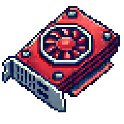

# VkUtils
## 🕶️ Overview
This project is my attempt to create a Vulkan API abstraction for C, as there are not many libraries available for C developers. This abstraction significantly simplifies the use of Vulkan without compromising performance. It is designed for simple to medium-sized games or scientific applications.

## 🤖 Discord
[](https://discord.gg/at7fpRyqvA)

## 📋 Features
- VkuContext abstracts key Vulkan objects like `VkInstance`, `VkDevice`, `VmaAllocator`, etc. It serves as the foundation for your program.
- The `VkuMemoryManager` uses AMD’s VMA (Vulkan Memory Allocator) to efficiently manage memory and handle the creation or destruction of `VkuBuffer` objects.
- The `VkuPresenter` manages the window and can be used as a render target. It encapsulates the VkSwapchainKHR and handles synchronization during rendering. It also recreates all necessary resources when the window is resized.
- A `VkuRenderStage` abstracts the management of a VkRenderPass along with its VkFramebuffer objects and associated resources (VkImage and VkImageView). When MSAA is enabled, render resources (excluding resolve targets) are shared across multiple render stages. A `VkuRenderStage` can be static (fixed resolution) or dynamic (resolution and format scale with the window).
- Provides simple utilities for creating 2D textures `VkuTexture2D` and texture arrays `VkuTexture2DArray` from pixel data (uint8_t*).
- Facilitates easy creation of descriptor sets `VkuDescriptorSet`, currently supporting `VkuSampler` (paired with a texture or texture array) and `VkuUniformBuffer`, while abstracting VkDescriptorSetLayout.
- Each `VkuRenderStage` can have multiple `VkuPipeline` objects. A pipeline takes shaders, `VkuVertexLayout`, and various rendering options as input, while abstracting the VkPipelineLayout.
- A frame is encapsulated within a `VkuFrame`, which manages the VkCommandBuffer. During the frame, render stages, pipelines, and other components can be bound, uniform buffers updated, and draw commands issued. All functions are wrapped with convenient VKU utilities.
- Full **C++ compatibility** (yes, C code can be not fully compatible with C++).
- **Async Buffer Destruction** Queue

## ⬇️ Installation
Simply include the **vkutils.c** and **vkutils.h** files from the `src/` folder in your project. Make sure to compile vkutils.c along with the other source files in your project.

## 💻 Quick Start
To quickly render something in the window, you need to create a VkuContext and a VkuPresenter. The VkuPresenter must be created **immediately** after the VkuContext, as it may reinitialize Vulkan objects to work seamlessly with the window.

Currently, there are three modes for a VkuContext:
- `VKU_CONTEXT_USAGE_BASIC`: Creates basic Vulkan objects. In the future, this mode can be used for offscreen rendering.
- `VKU_CONTEXT_USAGE_PRESENTATION`: Does not create Vulkan objects during VkuContext initialization. Instead, Vulkan objects are initialized with the appropriate requirements when a VkuPresenter is created. This mode will support frame-dependent compute in the future.
- `VKU_CONTEXT_USAGE_COMPUTE`: Not yet implemented, but will optimize the VkuContext for GPGPU offscreen applications.
```c
VkuContextCreateInfo contextCreateInfo = {
    .enableValidation = VK_TRUE, //enables Vulkan Validation
    .applicationName = "VkuTest",
    .applicationVersion = VK_MAKE_VERSION(1, 0, 0), //your application version
    .usage = VKU_CONTEXT_USAGE_PRESENTATION};

VkuContext context = vkuCreateContext(&contextCreateInfo);

VkuPresenterCreateInfo presenterCreateInfo = {
    .context = context,
    .width = 1152,
    .height = 720,
    .windowTitle = "VkuTest",
    .windowIconPath = "./resources/icon.png",
    .presentMode = VK_PRESENT_MODE_FIFO_KHR, //VK_PRESENT_MODE_FIFO_KHR is like vsync else VK_PRESENT_MODE_FIFO_KHR is recommended (as fast a possible)
    .framesInFlight = 2, //procomputed frames by the cpu. Distributes cpu load evenly at the cost of latency
};

VkuPresenter presenter = vkuCreatePresenter(&presenterCreateInfo);

// Creation of other Vku objects and renderloop

vkuDestroyPresenter(presenter);
vkuDestroyContext(context);
```
The creation of other Vulkan objects follows the same pattern. It’s similar to predefining the rendering process and then simply retrieving and using it in the render loop.
An example of a simple render loop might look like this:
```c
while (!vkuWindowShouldClose(presenter->window))
{
    VkuFrame frame = vkuPresenterBeginFrame(presenter);
    vkuFrameBeginRenderStage(frame, renderStage);
    vkuFrameBindPipeline(frame, pipeline);

    ubo ubo;
    glm_perspective(glm_rad(60.0f), vkuWindowGetAspect(presenter->window), 0.1f, 10.0f, ubo.projection);
    glm_lookat((vec3){2.0f, 0.0f, 0.0f}, (vec3){0.0f, 0.0f, 0.0f}, (vec3){0.001, 1.0f, 0.0f}, ubo.view);
    glm_mat4_identity(ubo.model);
    glm_rotate(ubo.model, 1.0f, (vec3){(float)sin(glfwGetTime()), (float)cos(glfwGetTime()), (float)sin(glfwGetTime())});
    vkuFrameUpdateUniformBuffer(frame, uniformBuffer, (void *)&ubo);
    vkuFrameDrawVertexBuffer(frame, vertexBuffer, 36);

    vkuFrameFinishRenderStage(frame, renderStage);
    vkuPresenterSubmitFrame(frame);
}
```

## ⚠️ Considerations & Warnings
- This library is not professional-grade and has not been extensively tested.
- I am not a native English speaker, so there might be spelling or grammar mistakes.
- This library is a by-product of developing my own game, and its features may depend on the specific requirements of that project.
- I am not a full-time developer. Currently, I am 19 years old and cannot guarantee consistent development or activity on this project alongside my university studies.

## 🏗️ Use in your Project
- **MIT License**
- A **mention** would be greatly appreciated. You are welcome to use the icon of this project as well.
- Feel free to message me if you'd like to share the cool projects you’re working on—I’d love to see them!